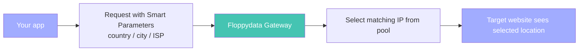

Geo targeting allows you to control where your requests appear to originate from.

Location is defined using **Smart Parameters** in your username and determines the **exit IP location** seen by target websites.

## Quick start

Basic example:

```bash
user123-res-country-US
```

More precise targeting:

```text
user123-res-country-US-city-New_York
```

## Supported targeting levels

Floppydata supports multiple levels of geographic targeting:

<CardGroup cols={2}>
  <Card title="Country">
    Most stable and widely supported option
  </Card>

  <Card title="State (US)">
    Target specific US states
  </Card>

  <Card title="City">
    More precise geo-targeting
  </Card>

  <Card title="ISP / Carrier">
    Target specific providers (advanced use cases)
  </Card>
</CardGroup>

## Country targeting

Country targeting is the most common and reliable option.

```text
user123-res-country-US
user123-res-country-DE
user123-mobile-country-BR
```

| Feature | Details |
| :-- | :-- |
| Format | ISO country codes |
| Availability | All proxy types |
| Default | Global routing if not specified |

## City targeting

City targeting allows more precise location control.

```text
user123-res-country-US-city-New_York
user123-res-country-DE-city-Berlin
```

<Note>
  • Use underscores instead of spaces\
  • Not all cities are available\
  • If unavailable, routing falls back to country level
</Note>

## State targeting (US only)

```text
user123-res-country-US-state-CA
user123-res-country-US-state-California
```

Can be combined with city:

```text
user123-res-country-US-state-CA-city-Los_Angeles
```

## ISP targeting

Routes traffic through a specific internet provider.

```text
user123-res-country-US-isp-Comcast
```

**Use cases:**

- ISP-specific testing
- ad verification
- maintaining geo consistency

## Mobile carrier targeting

Available for mobile proxies only.

```text
user123-mobile-country-US-carrier-T-Mobile
user123-mobile-country-DE-carrier-Deutsche_Telekom
```

## Combining parameters

You can combine targeting parameters for more precise routing:

```text
# Broad targeting
user123-res-country-US

# More specific
user123-res-country-US-city-Chicago

# Specific + sticky session
user123-res-country-US-city-Chicago-session-s01
```

<Warning>
  More specific targeting = smaller IP pool\
  → may affect speed or availability
</Warning>

## How it works



## Checking available locations

To get available countries and cities:

```bash
curl "https://client-api.floppy.host/v1/rotating/locations" \
  -H "X-Api-Key: YOUR_API_KEY"
```

## Why location checkers may differ

Sometimes IP lookup tools may show a different location than the one you targeted. In most cases, this does **not** mean routing is incorrect.

This usually happens because GeoIP services use different databases and update them at different times. The same IP may be classified differently depending on the service you check.

Common examples include:

- **ip-api**
- **ipinfo**
- **MaxMind**

Typical differences may include:

- the correct **country**, but a nearby **city**
- the correct location, but different **ISP / carrier** data
- different results across checkers for the same IP

This is more common with city, ISP, and carrier targeting than with country targeting.

### Quick troubleshooting

1. Check the IP in **more than one lookup service**
2. Confirm the **country** first, then review city / ISP / carrier details
3. If the country is correct but city or ISP differ slightly, it is usually a **GeoIP database difference**
4. If multiple checkers show the wrong country, verify your Smart Parameters and test again
5. If the result still does not match, contact support with:
   - your username format
   - the checker response
   - the target location you requested

## How to verify your location

Use a reliable IP checker:

```bash
curl -x "http://geo.g-w.info:10080" \
  -U "USERNAME:PASSWORD" \
  "https://ip-api.com/json"
```

If the result does not match your parameters, contact support with the response.

## Summary

<Note>
  • Geo targeting is controlled via Smart Parameters \
  • Country targeting is the most stable option \
  • City, ISP, and carrier targeting provide more precision \
  • More filters reduce the available IP pool
</Note>